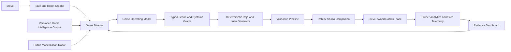

# RobloxForge Private Alpha Design

Status: approved direction, written 2026-07-14

## 1. Product objective

RobloxForge is a Steve-only Windows desktop application that makes creating, testing, publishing, monitoring, and improving a Roblox game substantially easier than working directly in Roblox Studio.

The product is not a general-purpose clone of Roblox Studio. It is an intelligent, beginner-first game factory that understands the intended player experience, converts that intent into an executable game operating model, provides a simplified visual editor, generates deterministic Roblox source, verifies the result in Roblox Studio, publishes to Steve-owned experiences, and uses real evidence to recommend improvements.

The private alpha is successful when Steve can:

1. Describe a game or provide reference experiences.
2. Review and revise what RobloxForge believes the game should achieve and how it should operate.
3. Generate and visually edit a complete game.
4. Run deterministic validation and an authoritative Roblox Studio playtest.
5. Publish a private version to an existing Steve-owned Roblox place.
6. Observe real gameplay, performance, and monetization evidence.
7. Approve an evidence-backed improvement and repeat the loop.

## 2. Private-alpha boundary

The first release serves Steve only.

- One allowlisted Clerk identity protects cloud-backed application services.
- Roblox universes, places, API keys, builds, and analytics belong to Steve.
- Open Cloud keys are least-privilege and universe-scoped.
- Secrets never enter React state, localStorage, logs, AI prompts, or build receipts.
- Roblox Open Cloud keys are stored in Windows Credential Manager and exposed only to Rust. OpenRouter and other server credentials are stored as Cloudflare Worker secrets.
- Public tenancy, public credential onboarding, subscriptions, and shared creator accounts are deferred.
- The public-product design will be revisited after the private alpha proves its create-to-improve loop.

Roblox does not currently expose a supported Create Universe API. Initial creation of a blank experience and some public-release gates remain Roblox Studio or Creator Dashboard actions. Place Publishing and Analytics Query use API-key authorization; the private ownership boundary makes those integrations viable for Steve-owned experiences.

## 3. Design principles

1. **Understand before generating.** The system must know the intended achievement, player fantasy, core loop, progression, operating rules, and success conditions before it writes a world or script.
2. **Structured intelligence over arbitrary prompting.** AI produces typed proposals and operations, not unrestricted filesystem commands.
3. **One source of truth.** The Game Operating Model drives the scene, systems, scripts, tests, analytics, and recommendations.
4. **Deterministic output.** The same approved model and generator version produce the same Rojo/Luau project.
5. **Fast preview, authoritative proof.** Browser 3D preview is approximate; Roblox Studio supplies engine truth.
6. **No false success.** Every build, test, publish, and analytics action returns an explicit receipt or a structured failure.
7. **Original patterns, not cloned expression.** Reference games provide structural context; RobloxForge does not copy proprietary code, assets, branding, maps, characters, audio, UI, or distinctive abilities.
8. **Evidence before monetization claims.** Competitor revenue is not inferred from visits or concurrent players. Public signals are ordinal research evidence; Steve-owned analytics provide exact portfolio evidence.
9. **Mobile and performance are game-design constraints.** Input count, camera demands, VFX, physics, replication, streaming, and UI density are budgeted before generation.

## 4. Core intelligence

### 4.1 Game Director

The Game Director is the single user-facing intelligence. Internally it coordinates five bounded roles:

- **Intent Interpreter:** converts rough language and reference links into a structured game brief.
- **Game Designer:** derives the player objective, gameplay loops, progression, level grammar, economy, retention, social systems, and failure/recovery rules.
- **World and Art Director:** defines visual language, environment grammar, lighting, camera, audio direction, spatial pacing, and asset constraints.
- **Roblox Systems Engineer:** maps approved mechanics to typed components, Luau services, networking, persistence, controls, and performance budgets.
- **Playtest and Growth Analyst:** evaluates Studio evidence and deployed analytics against the intended player journey.

OpenRouter provides model access through server-side routing. Cheap, bounded classification uses a lower-cost model; game planning, code review, and difficult diagnosis use stronger models. Provider failures do not silently change the product state.

### 4.2 Game Brief

The initial brief records:

- player promise and fantasy;
- primary and secondary genre;
- intended audience and content maturity;
- target devices and session length;
- reference experiences and explicitly admired traits;
- visual, emotional, and audio direction;
- business and monetization goals;
- confidence per inferred decision;
- material questions that still require Steve's answer.

RobloxForge infers safe defaults and asks only when uncertainty would materially change the game.

### 4.3 Game Operating Model

The approved brief becomes a versioned Game Operating Model containing:

- game thesis and final achievement;
- first-session promise and onboarding contract;
- second-to-second, minute-to-minute, session, and long-term loops;
- objective graph and runtime state machines;
- world, zone, stage, encounter, and landmark grammar;
- player capabilities, enemies, hazards, NPCs, items, and interactions;
- progression gates, rewards, currencies, sources, sinks, and economy invariants;
- success, failure, death, recovery, save, and reset rules;
- multiplayer roles, authority, replication, and anti-exploit boundaries;
- user interface, feedback, accessibility, and mobile contracts;
- art, lighting, audio, camera, and VFX direction;
- monetization surfaces with fairness and child-safety checks;
- analytics events, funnels, performance budgets, and acceptance tests;
- generator, knowledge-pack, and schema versions.

Every generated component and recommendation must trace to this model. A proposed pet system, for example, must strengthen the established loop, progression, expression, or monetization contract; otherwise the Director explains why it does not fit.

### 4.4 Intelligence corpus

The initial research contains 36 structured studies across three tracks, with deliberate overlap for cross-checking:

- obby, simulator, collector, and tycoon;
- battlegrounds, survival, horror, action, and RPG;
- racing, minigames, social roleplay, sandbox, building, and hybrids.

Each versioned record separates observation from interpretation and contains:

- experience identity and observed date;
- cited sources, evidence type, confidence, and conflicts;
- player promise and onboarding steps;
- core and meta loops;
- progression, world grammar, difficulty, economy, rewards, social hooks, retention, monetization, UI, and mobile implications;
- reusable patterns, genre-specific patterns, risks, and anti-patterns;
- volatile fields that require refreshing.

The corpus extracts repeatable principles such as immediate delivery of the fantasy, one honest loop during onboarding, three progression timescales, visible directors, informative failure, authored landmarks inside repeatable systems, meaningful social roles, transformational progression, and expression-first monetization.

The corpus is evidence-backed retrieval context. It is not model training data and does not contain copied source or assets.

### 4.5 Reference Game Mode

Steve can provide one or more Roblox experience URLs or names. RobloxForge creates a Design DNA analysis covering:

- what the player is trying to achieve;
- why the immediate loop is satisfying;
- how the session and long-term progression operate;
- how levels, economy, rewards, social systems, retention, and monetization support the loop;
- which mechanics are reusable patterns and which expression is distinctive to the reference.

The originality transformer then produces a new operating model by:

1. preserving only explicitly selected abstract mechanics or relationships;
2. combining corroborating patterns from at least three corpus records when possible;
3. changing theme, narrative, characters, names, spatial arrangement, assets, audio, UI, rewards, and distinctive abilities;
4. introducing at least one material mechanical or progression difference;
5. running a similarity and IP-risk review before generation.

The output explains what was inspired by a reference, what was transformed, and why the result is independently identifiable.

## 5. Creator experience

### 5.1 Create and understand

Steve describes an idea or supplies references. RobloxForge presents an editable understanding panel:

- what the game is about;
- what the player wants to accomplish;
- what players repeatedly do;
- how they progress, fail, recover, and win;
- how the game looks and feels;
- assumptions and confidence.

No build begins until the operating model is internally valid.

### 5.2 Design and build

The desktop editor contains:

- a simplified React Three Fiber world canvas;
- scene hierarchy and property inspector;
- curated, typed component palette;
- objective, progression, and behaviour views;
- Game Director conversation and proposal queue;
- before/after preview, explanation, approval, undo, and redo;
- an Advanced toggle that exposes the generated Luau and Rojo source.

The layout adapts to laptop and narrow widths. It does not reserve fixed side-panel widths that collapse the canvas. The renderer uses demand-based frames, shared geometry/materials, instancing where appropriate, adaptive device pixel ratio, bounded shadows, quality tiers, and no per-frame allocations or store writes.

### 5.3 Test and publish

One canonical generator creates the editable Rojo/Luau source and the artifact used for validation and publishing.

The test pipeline is:

1. schema and model validation;
2. deterministic generation;
3. Luau/static checks and unsupported-instance rejection;
4. Rojo build with pinned version, timeout, cancellation, and captured output;
5. Studio companion health check;
6. Studio MCP edit/playtest against the operating-model acceptance contract;
7. immutable evidence receipt;
8. publish preflight;
9. upload to an existing Steve-owned place;
10. partial-success-aware metadata update and final receipt.

Private deployment and public audience release are separate states. The product never claims a game is public merely because a place version uploaded.

### 5.4 Monitor and improve

The dashboard answers beginner-level questions before exposing raw metrics:

- Are players finding the game?
- Do they understand the first objective?
- Where do they fail or leave?
- Do they complete the core loop and progress?
- Do they return?
- Which products are seen and purchased?
- Did the latest version improve retention, performance, or revenue?

The Growth Analyst connects evidence to the operating model and proposes one bounded change at a time. No change or republish occurs without Steve's approval.

## 6. Monetization intelligence

### 6.1 Public Monetization Radar

The radar records only observable and attributable signals:

- official discovery or chart rank with timestamp, locale, device, and session context;
- concurrent players sampled over time;
- visit, favourite, and vote totals and velocity;
- rank persistence, update cadence, and visible event changes;
- publicly observable passes, prices, and monetization placement;
- human-reviewed loop, retention, social, and monetization architecture.

It must not convert visits, concurrent users, or rank into competitor revenue.

The Monetization Opportunity Signal is an ordinal, versioned score with separate confidence and uncertainty. It combines public momentum, rank evidence when available, monetization architecture, retention/live-ops structure, originality, build fit, mobile feasibility, safety, and policy risk. Missing data is not zero-filled, and low-confidence results shrink toward neutral.

### 6.2 Steve-owned analytics

For authorized universes, Analytics Query and owner data provide real:

- DAU and engagement;
- acquisition and conversion funnels;
- D1/D7 retention;
- revenue, paying users, payer conversion, ARPDAU, and ARPPU;
- custom events, economy events, and product outcomes;
- client/server performance, memory, FPS, crash, and place-version data.

Every template emits a standard server-side event contract for tutorial, core-loop, progression, objective, purchase, failure, and completion events. Deploy receipts correlate place versions with metric changes.

The system learns from Steve's portfolio outcomes only. It does not reverse-engineer competitor private metrics.

## 7. System architecture

### 7.1 Desktop

- React 19, TypeScript, Zustand, Tailwind, React Three Fiber, and Tauri v2.
- Rust owns filesystem, subprocess, credential, Studio, build, analytics, and publish boundaries.
- Projects are addressed by managed project IDs, not arbitrary frontend paths.
- Project source remains editable and exportable through Git/Rojo.

### 7.2 Cloudflare and AI

- Cloudflare Worker verifies the allowlisted Clerk identity and brokers OpenRouter requests.
- Model and server integration keys remain Worker secrets. The private alpha does not send Roblox credentials to Cloudflare.
- Requests use typed schemas, task-specific context budgets, timeout/cancellation, redacted errors, and immutable receipts.
- D1 stores metadata, provenance, radar snapshots, scores, and redacted cloud-operation receipt indexes.
- Git stores source and redacted project/build/test receipts. Generated binaries remain reproducible artifacts rather than a second source of truth.
- Queues handle bounded asynchronous research refresh and analytics queries.

### 7.3 Roblox integration

- Roblox OAuth is deferred for the Steve-only alpha. Clerk identifies Steve, while Rust uses Steve-owned, universe-scoped Open Cloud credentials for supported Roblox operations.
- Place Publishing uses a restricted Steve-owned API key and an existing universe/place.
- Analytics Query uses an owner-authorized analytics-read key.
- The Studio companion supplies authoritative engine validation and handles instance types or workflows not supported by Place Publishing.
- Creator Dashboard deep links handle unsupported account, audience, questionnaire, and moderation gates.

## 8. Security and privacy

Release-blocking controls are:

- canonicalize all project roots and reject absolute, traversal, symlink, and reparse-point escapes;
- validate relative paths, extensions, size, depth, and file-count limits;
- replace free-form AI command JSON with a strict tagged operation schema;
- stage AI changes transactionally and require preview/approval before commit;
- disable the existing Roblox OAuth entrypoints in the private alpha and keep all API keys out of JavaScript;
- store Roblox credentials in Windows Credential Manager and OpenRouter/server credentials in Cloudflare Worker secrets;
- restore a restrictive CSP and reduce Tauri capabilities/plugins;
- use one shared hardened HTTP client with bounded bodies, timeouts, cancellation, capped retry, and redacted errors;
- never retry an ambiguous publish POST automatically;
- remove any persisted or in-memory Roblox OAuth tokens left by the legacy implementation;
- prohibit cross-user training on project or Roblox-derived data;
- log provenance and operation results without content or credential leakage;
- scan reference transformations for IP, trademark, recognizable-character, asset, and distinctive-ability risk.

## 9. Error and receipt model

All privileged operations return a discriminated result with:

- operation ID and correlation ID;
- started/finished time;
- input artifact and configuration hashes;
- explicit state: queued, running, succeeded, failed, cancelled, or partial success;
- safe user message and bounded technical diagnostics;
- retry safety classification;
- generated artifact, test evidence, version, or external resource ID;
- next recovery action.

Project creation is transactional. Failed generation does not leave a directory that masquerades as a project. Publish distinguishes successful upload from failed metadata update. Dashboard network failures are not rendered as zero activity. Browser-development mocks are visibly labelled and cannot claim real validation, authentication, analytics, or publishing success.

## 10. Verification strategy

### 10.1 Automated tests

- TypeScript unit tests for schemas, stores, Game Operating Model transformations, generator inputs, undo, and score calculations.
- React integration tests for create, understand, approve, edit, validate, publish, and dashboard states.
- Rust unit/integration tests for project containment, AI operation parsing, transactional file mutation, disabled OAuth command exposure, credential redaction, Rojo subprocess lifecycle, resource packaging, Open Cloud errors, and publish partial success.
- Deterministic golden tests for Rojo/Luau output.
- Contract tests for Cloudflare/OpenRouter/Roblox adapters using recorded redacted fixtures.
- Security tests for traversal, absolute paths, reparse points, malformed model output, oversized context, CSP, and secret leakage.

### 10.2 Real-system proof

The alpha must demonstrate:

1. an idea and references becoming an approved operating model;
2. one complete Obby generated and edited;
3. a repeatable local build with no unsupported silent drops;
4. an authoritative Studio playtest receipt;
5. a private upload to a Steve-owned test place;
6. live owner analytics or clearly documented data-availability delay;
7. a dashboard recommendation tied to the operating model;
8. an approved improvement producing a second tested place version.

After the Obby vertical slice, collector/simulator and round-survival slices must pass the same contract before broader genre expansion.

### 10.3 Release checks

- `npm` dependencies installed through the serialized D-drive installer;
- frontend format, lint, typecheck, unit, integration, and production build;
- `cargo fmt --check`, strict `clippy`, locked tests, and release build;
- pinned Rojo build and template compatibility matrix;
- packaged Tauri resource and installer smoke test on Windows;
- browser and desktop walkthroughs at laptop and narrow widths;
- no false mocks, plaintext secrets, unreceipted privileged operations, or undocumented verification failures;
- clean Git status, GitHub push, and verified all-refs D-drive bundle.

## 11. Delivery program and leads

The root Integration Lead owns architecture, repository safety, cross-lane review, integration, verification, release evidence, and durable save.

Parallel bounded lanes are:

1. **Intelligence Lead**
   - Game Brief and Game Operating Model schemas;
   - corpus storage and provenance;
   - reference deconstruction and originality review;
   - Monetization Radar and owner-evidence analysis;
   - Game Director orchestration and model routing.

2. **Creator Lead**
   - create/understand/approve journey;
   - responsive 3D editor and component model;
   - structured proposals, preview, undo, and redo;
   - accessible laptop/mobile-aware UX;
   - removal of dangerous false browser-success states.

3. **Roblox Platform Lead**
   - secure Tauri boundaries and credentials;
   - one canonical Rojo/Luau generator and resource packaging;
   - Studio companion and test receipts;
   - Place Publishing and owner analytics;
   - production installer and platform verification.

The lanes integrate through versioned schemas and receipts. Leads do not edit the same implementation files concurrently. The Integration Lead runs a review and full verification pass after every merged slice.

## 12. Delivery order

1. Preserve legacy work and establish the canonical sprint branch.
2. Restore a truthful green build and test baseline.
3. Secure project, AI, credential, CSP, and subprocess boundaries.
4. Implement Game Brief and Game Operating Model schemas.
5. Complete the Obby create-to-edit vertical slice.
6. Add Studio proof and Steve-owned private publishing.
7. Add owner analytics, standard events, and evidence dashboard.
8. Add the game corpus, reference transformation, and Monetization Radar to the Director.
9. Prove a second evidence-driven update to the Obby.
10. Expand to collector/simulator and round-survival contracts.
11. Package, smoke-test, commit, push, and bundle the private alpha.

## 13. Deferred public-product work

- multi-tenant authorization and billing;
- public credential/onboarding model;
- creator collaboration and sharing;
- public OAuth application review and privacy/terms release;
- generalized support for arbitrary user-owned publishing and analytics;
- public marketplace or community templates;
- cross-account operational support.

## 14. Primary platform references

- Roblox Studio: https://create.roblox.com/docs/studio
- AI accelerated workflows and Studio MCP: https://create.roblox.com/docs/ai/accelerated-workflows
- Projects and publishing: https://create.roblox.com/docs/projects
- Place Publishing: https://create.roblox.com/docs/cloud/guides/usage-place-publishing
- Open Cloud: https://create.roblox.com/docs/cloud
- OAuth 2.0: https://create.roblox.com/docs/cloud/auth/oauth2-reference
- Analytics Query: https://create.roblox.com/docs/cloud/guides/analytics
- Analytics metrics: https://create.roblox.com/docs/cloud/guides/analytics/metrics
- Creator analytics: https://create.roblox.com/docs/production/analytics/analytics-dashboard
- Assets API: https://create.roblox.com/docs/cloud/guides/usage-assets
- Creator Store API: https://create.roblox.com/docs/projects/assets/api
- Rojo: https://rojo.space/docs/v7/
